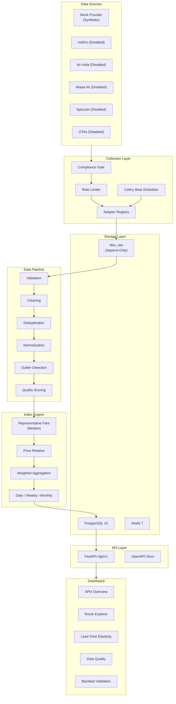

# AirIndex India — Complete Phased Implementation Plan

> **Project:** Real-time Airfare Price Index (APIx) for NSO/RBI  
> **Current State:** Phase 0 — Repository Initialized; **Zero executable code**  
> **Target:** End-to-end working prototype with 30-day backtested results  
> **Date:** 2026-09-10

---

## Existing Asset Inventory

After analysing every document ([PROJECT_STATUS.md](file:///c:/Users/abhin/Desktop/AirIndex_India/PROJECT_STATUS.md), [ARCHITECTURE.md](file:///c:/Users/abhin/Desktop/AirIndex_India/ARCHITECTURE.md), [ROADMAP.md](file:///c:/Users/abhin/Desktop/AirIndex_India/ROADMAP.md), [KNOWN_ISSUES.md](file:///c:/Users/abhin/Desktop/AirIndex_India/KNOWN_ISSUES.md), [AGENTS.md](file:///c:/Users/abhin/Desktop/AirIndex_India/AGENTS.md), [DATABASE.md](file:///c:/Users/abhin/Desktop/AirIndex_India/DATABASE.md), [DATA_DICTIONARY.md](file:///c:/Users/abhin/Desktop/AirIndex_India/DATA_DICTIONARY.md), [API_SPEC.md](file:///c:/Users/abhin/Desktop/AirIndex_India/API_SPEC.md), [STATISTICAL_METHODOLOGY.md](file:///c:/Users/abhin/Desktop/AirIndex_India/STATISTICAL_METHODOLOGY.md), [DECISIONS.md](file:///c:/Users/abhin/Desktop/AirIndex_India/DECISIONS.md), [DEVELOPMENT_PLAN.md](file:///c:/Users/abhin/Desktop/AirIndex_India/DEVELOPMENT_PLAN.md), [DATA_PIPELINE.md](file:///c:/Users/abhin/Desktop/AirIndex_India/DATA_PIPELINE.md), [SCRAPING_POLICY.md](file:///c:/Users/abhin/Desktop/AirIndex_India/SCRAPING_POLICY.md), [SECURITY.md](file:///c:/Users/abhin/Desktop/AirIndex_India/SECURITY.md), [TESTING.md](file:///c:/Users/abhin/Desktop/AirIndex_India/TESTING.md), [DEPLOYMENT.md](file:///c:/Users/abhin/Desktop/AirIndex_India/DEPLOYMENT.md), [ENVIRONMENT.md](file:///c:/Users/abhin/Desktop/AirIndex_India/ENVIRONMENT.md)):

| What Exists | What Does NOT Exist |
|---|---|
| Modular monorepo directory skeleton | Any Python packages, `pyproject.toml`, or `requirements.txt` |
| 4 YAML configs (routes, sources, advance_windows, index) | Any Pydantic models or config loaders |
| 5 ADR decisions (ADR-001 through ADR-005) | Any SQLAlchemy models or Alembic migrations |
| Data dictionary with 30+ planned fields | Any database tables or seed data |
| Planned API endpoints (11 routes) | Any FastAPI app or endpoint code |
| Statistical methodology doc (prototype) | Any index calculation code |
| `.gitkeep` placeholders in `collectors/base`, `collectors/mock` | Any collector/adapter code |
| Empty `data_pipeline/` sub-dirs | Any pipeline stage code |
| `frontend/src/` placeholder | Any React/TypeScript/Vite code |
| `docker-compose.yml` with `services: {}` | Any runnable Docker services |

---

## User Review Required

> [!IMPORTANT]
> **This plan implements Phases 1–15 from [ROADMAP.md](file:///c:/Users/abhin/Desktop/AirIndex_India/ROADMAP.md).** Each phase will be executed sequentially, with documentation updated at every step. I will stop at major gate boundaries and report progress.

> [!WARNING]
> **Known Blockers (from [KNOWN_ISSUES.md](file:///c:/Users/abhin/Desktop/AirIndex_India/KNOWN_ISSUES.md)):**
> - Official PSD/MoSPI methodology, weights, and base period are unavailable → prototype assumptions will be clearly labeled `DEMO / PROTOTYPE / ASSUMPTION`
> - DGCA reference dataset is not supplied → backtesting will use synthetic reference data with realistic patterns
> - No airline/OTA has authorized scraping → all development uses the MOCK source; real connectors remain disabled (`enabled: false`)
> - All prototype statistical parameters are configurable for future replacement

---

## Open Questions

> [!IMPORTANT]
> 1. **Python version**: [ENVIRONMENT.md](file:///c:/Users/abhin/Desktop/AirIndex_India/ENVIRONMENT.md) targets 3.12. Should I confirm 3.12 or use 3.11 for wider Docker-base compatibility?
> 2. **Node.js version**: Target is Node 22 LTS. Confirm this is installed or should I handle installation?
> 3. **PostgreSQL**: Should I set up a local PostgreSQL 16 instance, or run exclusively via Docker Compose?
> 4. **Execution scope**: Do you want me to implement all 15 phases sequentially in this conversation, or do you want to approve/review after each phase grouping?

---

## Phase-by-Phase Implementation Plan

### ═══════════════════════════════════════════════
### PHASE 1 — Domain Models & Configuration Loaders
### ═══════════════════════════════════════════════

**Goal:** Typed Python domain models and validated config loaders — the foundation everything builds on.

**Deliverables:**
- Python project setup (`pyproject.toml` with all dependencies)
- Pydantic domain models for every entity in [DATA_DICTIONARY.md](file:///c:/Users/abhin/Desktop/AirIndex_India/DATA_DICTIONARY.md)
- Enum definitions for all categorical fields
- YAML config loaders with Pydantic validation
- Unit tests for all models and loaders

#### [NEW] `pyproject.toml`
- Project metadata, dependency groups (core, dev, test)
- Dependencies: `fastapi`, `uvicorn`, `pydantic>=2`, `sqlalchemy>=2`, `alembic`, `psycopg[binary]`, `celery`, `redis`, `pyyaml`, `httpx`
- Dev deps: `pytest`, `pytest-asyncio`, `ruff`, `mypy`, `black`, `coverage`

#### [NEW] `backend/app/__init__.py`
#### [NEW] `backend/app/core/__init__.py`
#### [NEW] `backend/app/core/config.py`
- `Settings` class using `pydantic-settings` reading from `.env`
- All variables from [`.env.example`](file:///c:/Users/abhin/Desktop/AirIndex_India/.env.example)

#### [NEW] `backend/app/schemas/__init__.py`
#### [NEW] `backend/app/schemas/enums.py`
- `SourceType`: `AIRLINE`, `OTA`, `FEED`, `MOCK`
- `AvailabilityStatus`: `AVAILABLE`, `SOLD_OUT`, `CANCELLED`, `NOT_AVAILABLE`, `UNKNOWN`
- `CancellationStatus`: `ACTIVE`, `CANCELLED`, `UNKNOWN`
- `QualityStatus`: `PENDING`, `VALID`, `FLAGGED`, `INVALID`
- `ComplianceStatus`: `APPROVED`, `APPROVED_FOR_SYNTHETIC_DEVELOPMENT`, `UNKNOWN`, `RESTRICTED`, `DISALLOWED`
- `FareClass`: `ECONOMY`, `PREMIUM_ECONOMY`, `BUSINESS`, `FIRST`, `UNKNOWN`
- `IndexFrequency`: `DAILY`, `WEEKLY`, `MONTHLY`

#### [NEW] `backend/app/schemas/domain.py`
- `Airport`, `Airline`, `Route`, `RouteWeight`, `AdvanceWindow`, `Source`, `FareComponent`, `FareObservation`
- All 30+ fields from [DATA_DICTIONARY.md](file:///c:/Users/abhin/Desktop/AirIndex_India/DATA_DICTIONARY.md) as typed Pydantic models
- `advance_purchase_days` as a derived computed field

#### [NEW] `backend/app/schemas/config_models.py`
- `RoutesConfig`, `SourcesConfig`, `AdvanceWindowsConfig`, `IndexConfig`
- Validators matching structure in [`configs/*.yml`](file:///c:/Users/abhin/Desktop/AirIndex_India/configs)

#### [NEW] `backend/app/core/config_loader.py`
- Load and validate each YAML config file
- Return typed config objects
- Raise clear errors on invalid config

#### [NEW] `tests/unit/test_schemas.py`
#### [NEW] `tests/unit/test_config_loader.py`

---

### ═══════════════════════════════════════════════
### PHASE 2 — PostgreSQL Schema & Alembic Migrations
### ═══════════════════════════════════════════════

**Goal:** Complete relational schema with migrations matching [DATABASE.md](file:///c:/Users/abhin/Desktop/AirIndex_India/DATABASE.md).

**Deliverables:**
- SQLAlchemy 2.0 ORM models for all planned tables
- Alembic configuration and initial migration
- Seed data for reference tables (airports, airlines)
- Database connection management

#### [NEW] `backend/app/models/__init__.py`
#### [NEW] `backend/app/models/base.py`
- SQLAlchemy `DeclarativeBase`, common mixins (timestamps, UUID PKs)

#### [NEW] `backend/app/models/reference.py`
- `City`, `Airport`, `Airline`, `Route`, `Source`, `SourceConnector` tables

#### [NEW] `backend/app/models/operations.py`
- `ScrapingJob`, `ScrapingRun`, `SystemEvent` tables

#### [NEW] `backend/app/models/evidence.py`
- `FareRaw` — append-only immutable raw payload storage

#### [NEW] `backend/app/models/processed.py`
- `FareObservation`, `FareComponent`, `ValidationResult`, `DataQuality`, `Anomaly`

#### [NEW] `backend/app/models/methodology.py`
- `RouteWeight`, `CalculationVersion`, `ConfigVersion`

#### [NEW] `backend/app/models/outputs.py`
- `IndexValue`, `IndexComponent`

#### [NEW] `backend/app/core/database.py`
- Engine creation, session factory, dependency injection

#### [NEW] `database/migrations/alembic.ini`
#### [NEW] `database/migrations/env.py`
#### [NEW] `database/migrations/versions/001_initial_schema.py`

#### [NEW] `database/seed/airports.json`
- All major Indian airports (DEL, BOM, BLR, MAA, CCU, HYD, GOI, AMD, PNQ, JAI, etc.)

#### [NEW] `database/seed/airlines.json`
- IndiGo (6E), Air India (AI), Air India Express (IX), Akasa Air (QP), SpiceJet (SG)

#### [NEW] `database/seed/seed_loader.py`
- Idempotent seed script

#### [NEW] `tests/integration/test_models.py`
#### [NEW] `tests/integration/test_migrations.py`

---

### ═══════════════════════════════════════════════
### PHASE 3 — Mock Airfare Provider
### ═══════════════════════════════════════════════

**Goal:** Deterministic synthetic fare generator producing realistic Indian domestic airfare data.

**Deliverables:**
- Mock adapter implementing the collector interface
- Generates 30+ days of realistic fare data across all configured routes, airlines, and windows
- Deterministic (seeded) output for reproducible testing
- Clearly labeled as `SYNTHETIC / MOCK`

#### [NEW] `collectors/base/adapter.py`
- Abstract `BaseSourceAdapter` with `collect()`, `parse()`, `health_check()` interface
- Compliance gate: checks `enabled` and `compliance_status` before collection

#### [NEW] `collectors/base/models.py`
- `CollectionRequest`, `CollectionResult`, `RawFareRecord`

#### [NEW] `collectors/mock/provider.py`
- `MockAirfareProvider(BaseSourceAdapter)`
- Generates fares using realistic Indian domestic pricing patterns:
  - Base fare: ₹2,500–₹12,000 depending on route distance
  - Lead-time elasticity: T+1 is 2–4x more expensive than T+45
  - Day-of-week effects (weekday vs weekend)
  - Festival/demand surges (Diwali, Holi windows)
  - Airline-specific pricing bands (LCC vs FSC)
  - Random availability states (5% SOLD_OUT, 2% CANCELLED)
  - Fare component breakdown (base, taxes, airport charges, UDF, convenience fee)
- Deterministic via `seed` parameter
- Labels all output as `SYNTHETIC`

#### [NEW] `collectors/mock/patterns.py`
- Route distance matrix for realistic base-fare scaling
- Seasonal/festival multiplier calendar
- Lead-time elasticity curves

#### [NEW] `tests/unit/test_mock_provider.py`
- Determinism test (same seed → same output)
- Coverage tests (all routes, airlines, windows)
- Validity tests (no zero prices for available flights, components sum to total)

---

### ═══════════════════════════════════════════════
### PHASE 4 — Data Quality Pipeline
### ═══════════════════════════════════════════════

**Goal:** Complete validation → cleaning → dedup → normalization → outlier → quality pipeline per [DATA_PIPELINE.md](file:///c:/Users/abhin/Desktop/AirIndex_India/DATA_PIPELINE.md).

**Deliverables:**
- Each pipeline stage as an independent, testable module
- Audit trail: every decision recorded, nothing silently discarded

#### [NEW] `data_pipeline/cleaning/cleaner.py`
- Whitespace/encoding normalization, fare-component reconciliation
- Versioned correction rules; raw data never mutated

#### [NEW] `data_pipeline/deduplication/deduplicator.py`
- Composite key: (source, route, airline, flight_number, departure_date, departure_time, observed_at)
- Confidence scoring for probable duplicates
- Links duplicates rather than deleting

#### [NEW] `data_pipeline/normalization/normalizer.py`
- Map source-specific codes → canonical enums
- Airport code validation, airline code validation
- Fare class normalization, currency validation

#### [NEW] `data_pipeline/outliers/detector.py`
- IQR method, MAD method, robust z-score
- Route-history threshold method
- Outliers flagged with method/version, never deleted
- Per [STATISTICAL_METHODOLOGY.md](file:///c:/Users/abhin/Desktop/AirIndex_India/STATISTICAL_METHODOLOGY.md): `outlier_policy: flag_only`

#### [NEW] `data_pipeline/quality/scorer.py`
- Multi-factor quality score (0–100):
  - Completeness (all fare components present?)
  - Source reliability (configured per source)
  - Parsing confidence
  - Duplicate likelihood
  - Timestamp validity
  - Anomaly flags
- Output: `QualityStatus` enum + numeric score + factor breakdown

#### [NEW] `data_pipeline/pipeline.py`
- Orchestrator that chains all stages
- Transaction-safe: batch commits per stage
- Idempotent: rerunnable without duplicating outputs

#### [NEW] `tests/unit/test_cleaning.py`
#### [NEW] `tests/unit/test_deduplication.py`
#### [NEW] `tests/unit/test_normalization.py`
#### [NEW] `tests/unit/test_outliers.py`
#### [NEW] `tests/unit/test_quality.py`
#### [NEW] `tests/integration/test_pipeline.py`

---

### ═══════════════════════════════════════════════
### PHASE 5 — Index Engine
### ═══════════════════════════════════════════════

**Goal:** Configurable, collector-independent statistical index calculation per [STATISTICAL_METHODOLOGY.md](file:///c:/Users/abhin/Desktop/AirIndex_India/STATISTICAL_METHODOLOGY.md).

**Deliverables:**
- Representative fare calculation (configurable: median/mean/trimmed mean)
- Price relative computation
- Weighted route/composite aggregation
- Daily, weekly, monthly index values
- Full provenance chain

#### [NEW] `backend/app/index_engine/__init__.py`
#### [NEW] `backend/app/index_engine/representative_fare.py`
- Compute representative fare per cell (route × lead-time × period)
- Configurable statistic: median (default), mean, trimmed mean
- Minimum cell observation threshold from [index.yml](file:///c:/Users/abhin/Desktop/AirIndex_India/configs/index.yml)
- Eligibility rules: only `VALID` quality, `AVAILABLE` status

#### [NEW] `backend/app/index_engine/price_relative.py`
- `price_relative = current_representative / base_representative × 100`
- Handle missing base period gracefully (configurable first-observation fallback for prototype)

#### [NEW] `backend/app/index_engine/aggregator.py`
- Weighted aggregation of route-level price relatives → composite APIx
- Missing-cell policy from config
- Weight redistribution (when approved)

#### [NEW] `backend/app/index_engine/frequency.py`
- Daily: direct from daily cells
- Weekly: configurable aggregation (mean/median of daily values)
- Monthly: configurable aggregation of daily/weekly values

#### [NEW] `backend/app/index_engine/calculator.py`
- Main orchestrator: takes eligible observations + config → produces `IndexValue` + `IndexComponent` records
- Provenance: references calculation version, config version, contributing cells, weights, excluded records

#### [NEW] `tests/unit/test_representative_fare.py`
#### [NEW] `tests/unit/test_price_relative.py`
#### [NEW] `tests/unit/test_aggregator.py`
#### [NEW] `tests/unit/test_calculator.py`

---

### ═══════════════════════════════════════════════
### PHASE 6 — FastAPI Services & REST API
### ═══════════════════════════════════════════════

**Goal:** Versioned `/api/v1` endpoints matching [API_SPEC.md](file:///c:/Users/abhin/Desktop/AirIndex_India/API_SPEC.md).

**Deliverables:**
- All 11 planned endpoints
- Repository pattern for data access
- Service layer for business logic
- Pydantic response schemas with envelope
- OpenAPI/Swagger auto-docs

#### [NEW] `backend/app/main.py`
- FastAPI application factory, CORS, exception handlers, router registration

#### [NEW] `backend/app/repositories/fare_repository.py`
#### [NEW] `backend/app/repositories/index_repository.py`
#### [NEW] `backend/app/repositories/route_repository.py`
#### [NEW] `backend/app/repositories/quality_repository.py`

#### [NEW] `backend/app/services/index_service.py`
#### [NEW] `backend/app/services/fare_service.py`
#### [NEW] `backend/app/services/route_service.py`
#### [NEW] `backend/app/services/quality_service.py`

#### [NEW] `backend/app/schemas/responses.py`
- `ApiEnvelope[T]` with `data`, `meta`, `generated_at`
- Error response with `code`, `message`, `request_id`
- Pagination metadata

#### [NEW] `backend/app/api/__init__.py`
#### [NEW] `backend/app/api/v1/__init__.py`
#### [NEW] `backend/app/api/v1/index.py` — `/api/v1/index/*` (current, daily, weekly, monthly, history)
#### [NEW] `backend/app/api/v1/routes.py` — `/api/v1/routes`, `/api/v1/routes/{route}/trend`
#### [NEW] `backend/app/api/v1/fares.py` — `/api/v1/fares`
#### [NEW] `backend/app/api/v1/sources.py` — `/api/v1/sources/status`
#### [NEW] `backend/app/api/v1/quality.py` — `/api/v1/data-quality`
#### [NEW] `backend/app/api/v1/validation.py` — `/api/v1/validation`

#### [NEW] `tests/integration/test_api_index.py`
#### [NEW] `tests/integration/test_api_routes.py`
#### [NEW] `tests/integration/test_api_fares.py`

---

### ═══════════════════════════════════════════════
### PHASE 7 — React Government Dashboard
### ═══════════════════════════════════════════════

**Goal:** Interactive statistical dashboard per the problem statement requirements.

**Tech Stack:** React 18, TypeScript, Vite, Tailwind CSS, ECharts (per [AGENTS.md](file:///c:/Users/abhin/Desktop/AirIndex_India/AGENTS.md) technology baseline)

**Deliverables:**
- 5 main dashboard views
- Real-time data from API
- Export capabilities

#### Dashboard Views

1. **APIx Overview** — Current composite index, daily/weekly/monthly trend lines, key statistics
2. **Route Explorer** — Sector-wise heatmap, route comparison charts, drill-down by route
3. **Lead-Time Elasticity** — Advance-purchase window curves showing T+1 through T+45 pricing
4. **Data Quality Monitor** — Coverage metrics, source health, quality distribution
5. **Backtest/Validation** — DGCA comparison charts, deviation analysis

#### [NEW] `frontend/` — Full Vite + React + TS project
- `package.json`, `tsconfig.json`, `vite.config.ts`, `tailwind.config.js`
- `src/App.tsx` — Router, layout, navigation
- `src/pages/Dashboard.tsx` — APIx overview
- `src/pages/RouteExplorer.tsx` — Route heatmap + trends
- `src/pages/LeadTimeElasticity.tsx` — Advance-purchase curves
- `src/pages/DataQuality.tsx` — Quality monitoring
- `src/pages/Validation.tsx` — Backtest results
- `src/components/charts/` — ECharts wrapper components
- `src/api/client.ts` — API client with typed responses
- `src/types/` — TypeScript types mirroring API schemas

---

### ═══════════════════════════════════════════════
### PHASE 8 — Source Adapter Framework & Mock Integration
### ═══════════════════════════════════════════════

**Goal:** Production-grade adapter framework, mock connector fully integrated into the pipeline.

#### [NEW] `collectors/base/registry.py`
- Adapter registry, discovery, instantiation from config
- Compliance gate enforcement

#### [NEW] `collectors/base/rate_limiter.py`
- Per-source rate limiting from `sources.yml`
- Token bucket / sliding window

#### [MODIFY] `collectors/mock/provider.py`
- Integrate with pipeline: raw → validate → clean → index

---

### ═══════════════════════════════════════════════
### PHASE 9 — Celery/Redis Scheduling & Workers
### ═══════════════════════════════════════════════

**Goal:** Automated scheduled collection and index computation.

#### [NEW] `backend/app/core/celery_app.py`
- Celery application with Redis broker

#### [NEW] `backend/app/tasks/collection_tasks.py`
- `collect_fares` task per source × route batch
- Scheduled via Celery Beat

#### [NEW] `backend/app/tasks/pipeline_tasks.py`
- `run_pipeline` task — validation through quality scoring

#### [NEW] `backend/app/tasks/index_tasks.py`
- `compute_daily_index`, `compute_weekly_index`, `compute_monthly_index`

#### [NEW] `configs/celery_schedule.yml`
- Beat schedule: collection every 6h, pipeline after collection, daily index at midnight IST

---

### ═══════════════════════════════════════════════
### PHASE 10 — External Source Connectors (Disabled)
### ═══════════════════════════════════════════════

**Goal:** Implement adapter structure for real airlines/OTAs — **all disabled by default** per [SCRAPING_POLICY.md](file:///c:/Users/abhin/Desktop/AirIndex_India/SCRAPING_POLICY.md).

> [!CAUTION]
> Per ADR-005 and SCRAPING_POLICY.md, no real source connector will be enabled until authorization is recorded and owner-approved. All connectors ship with `enabled: false` and `compliance_status: UNKNOWN`.

#### [NEW] `collectors/airlines/indigo.py` — IndiGo adapter (disabled)
#### [NEW] `collectors/airlines/air_india.py` — Air India adapter (disabled)
#### [NEW] `collectors/airlines/air_india_express.py` — Air India Express adapter (disabled)
#### [NEW] `collectors/airlines/akasa_air.py` — Akasa Air adapter (disabled)
#### [NEW] `collectors/airlines/spicejet.py` — SpiceJet adapter (disabled)
#### [NEW] `collectors/otas/makemytrip.py` — MakeMyTrip adapter (disabled)

Each adapter:
- Implements `BaseSourceAdapter` interface
- Has `compliance_status: UNKNOWN` → fails closed
- Contains parser for source-specific fare structure
- Rate-limited per `sources.yml` configuration
- Full robots.txt and ToS checking built in

---

### ═══════════════════════════════════════════════
### PHASE 11 — 30-Day Backtesting
### ═══════════════════════════════════════════════

**Goal:** Reproducible 30-day backtest demonstrating the full pipeline.

#### [NEW] `scripts/backtest.py`
- Generate 30 days of synthetic observations using mock provider (seed-controlled)
- Run full pipeline (validate → clean → dedup → normalize → outlier → quality)
- Compute daily, weekly, monthly indices
- Generate backtest report with:
  - Daily APIx values and trend
  - Route-level index values
  - Lead-time elasticity analysis
  - Coverage statistics
  - Outlier analysis

#### [NEW] `scripts/generate_backtest_data.py`
- Standalone script for bulk mock data generation

#### [NEW] `backend/app/analytics/backtest_report.py`
- Structured backtest report generator

---

### ═══════════════════════════════════════════════
### PHASE 12 — DGCA Reference Validation
### ═══════════════════════════════════════════════

**Goal:** Comparison framework against DGCA monthly average-fare data.

> [!NOTE]
> Since actual DGCA data is not available, this phase builds the comparison infrastructure and tests it with synthetic reference data that mimics DGCA report structure.

#### [NEW] `backend/app/analytics/dgca_adapter.py`
- Parser for DGCA monthly average fare reports (CSV/Excel format)
- Mapping: DGCA route codes → internal route codes

#### [NEW] `backend/app/analytics/validation_engine.py`
- Coverage comparison
- Directional agreement (both show increase/decrease)
- Correlation analysis (Pearson, Spearman)
- Deviation analysis with explainable factors

#### [NEW] `database/seed/dgca_reference_synthetic.json`
- Clearly labeled synthetic DGCA-format reference data

---

### ═══════════════════════════════════════════════
### PHASE 13 — Automated Testing & Quality Gates
### ═══════════════════════════════════════════════

**Goal:** Comprehensive test suite and CI-ready quality checks.

#### Test Coverage Targets

| Layer | Scope | Target |
|---|---|---|
| Unit | Models, schemas, config, pipeline stages, index engine | ≥ 85% |
| Integration | DB repos, API endpoints, full pipeline | ≥ 70% |
| E2E | Mock → raw → pipeline → index → API → dashboard flow | Critical paths |
| Contract | API schema stability | All endpoints |

#### [NEW] `tests/e2e/test_full_flow.py`
- Mock ingestion → pipeline → index → API → verify dashboard data

#### [NEW] `tests/contract/test_api_schema.py`
- Schema snapshot tests for API stability

#### [NEW] `pyproject.toml` [MODIFY]
- Add ruff, mypy, pytest, coverage configurations
- Scripts: `lint`, `typecheck`, `test`, `test-coverage`

---

### ═══════════════════════════════════════════════
### PHASE 14 — Docker Deployment & Operational Hardening
### ═══════════════════════════════════════════════

**Goal:** Fully containerized deployment per [DEPLOYMENT.md](file:///c:/Users/abhin/Desktop/AirIndex_India/DEPLOYMENT.md).

#### [MODIFY] `docker-compose.yml`
- PostgreSQL 16 with health checks
- Redis 7
- FastAPI backend (Uvicorn)
- Celery workers (collection + pipeline)
- Celery Beat scheduler
- Frontend (Nginx serving Vite build)

#### [NEW] `backend/Dockerfile`
#### [NEW] `frontend/Dockerfile`
#### [NEW] `scripts/docker-entrypoint.sh`
- Wait for DB, run migrations, seed, start

#### Health checks, resource limits, logging configuration

---

### ═══════════════════════════════════════════════
### PHASE 15 — SIH Demo Dataset & Presentation
### ═══════════════════════════════════════════════

**Goal:** Demo-ready package for Smart India Hackathon presentation.

#### [NEW] `scripts/generate_demo_dataset.py`
- Pre-generate 30-day demo dataset
- Load into database
- Pre-compute all indices

#### [NEW] `docs/demo/DEMO_SCRIPT.md`
- Step-by-step demo walkthrough
- Key talking points for SIH judges
- Architecture diagram
- Screenshot guide

#### [NEW] `docs/demo/presentation_assets/`
- Architecture diagram
- Data flow diagram
- Dashboard screenshots

---

## Technical Architecture Diagram



---

## Execution Schedule

| Phase | Scope | Est. Effort | Key Output |
|---|---|---|---|
| **1** | Domain Models & Config | Medium | `pyproject.toml`, Pydantic models, config loaders |
| **2** | Database Schema | Medium | SQLAlchemy models, Alembic migrations, seed data |
| **3** | Mock Provider | Medium | Deterministic synthetic fare generator |
| **4** | Data Pipeline | Large | 5-stage pipeline with audit trail |
| **5** | Index Engine | Large | Configurable APIx calculator with provenance |
| **6** | FastAPI API | Large | 11 endpoints, repositories, services |
| **7** | React Dashboard | Large | 5 dashboard views with ECharts |
| **8** | Adapter Framework | Medium | Registry, rate limiter, mock integration |
| **9** | Celery Workers | Medium | Scheduled collection + computation |
| **10** | Source Connectors | Medium | 6 disabled airline/OTA adapters |
| **11** | 30-Day Backtest | Medium | Reproducible backtest report |
| **12** | DGCA Validation | Medium | Comparison framework + synthetic reference |
| **13** | Test Expansion | Medium | ≥85% unit coverage, E2E tests |
| **14** | Docker Deployment | Medium | Full `docker-compose.yml`, Dockerfiles |
| **15** | Demo Package | Small | Demo dataset, script, presentation assets |

---

## Verification Plan

### Automated Tests
```bash
# Run after each phase
pytest tests/ -v --tb=short
ruff check backend/ collectors/ data_pipeline/
mypy backend/ --strict

# Integration (requires PostgreSQL)
pytest tests/integration/ -v

# E2E (after Phase 13)
pytest tests/e2e/ -v

# Coverage report
pytest --cov=backend --cov=collectors --cov=data_pipeline --cov-report=html
```

### Manual Verification
- After Phase 6: Test all API endpoints via Swagger UI at `http://localhost:8000/docs`
- After Phase 7: Visual verification of all 5 dashboard views
- After Phase 11: Review backtest report for 30-day index values
- After Phase 14: `docker compose up` and verify full stack

---

## Documentation Updates Per Phase

Every phase will update the following documents as affected:

| Document | Updated When |
|---|---|
| [PROJECT_STATUS.md](file:///c:/Users/abhin/Desktop/AirIndex_India/PROJECT_STATUS.md) | Every phase |
| [CHANGELOG.md](file:///c:/Users/abhin/Desktop/AirIndex_India/CHANGELOG.md) | Every phase |
| [ROADMAP.md](file:///c:/Users/abhin/Desktop/AirIndex_India/ROADMAP.md) | Phase completion checkmarks |
| [ARCHITECTURE.md](file:///c:/Users/abhin/Desktop/AirIndex_India/ARCHITECTURE.md) | Phases 1, 2, 6, 9, 14 |
| [DATA_DICTIONARY.md](file:///c:/Users/abhin/Desktop/AirIndex_India/DATA_DICTIONARY.md) | Phases 1, 2 |
| [API_SPEC.md](file:///c:/Users/abhin/Desktop/AirIndex_India/API_SPEC.md) | Phase 6 |
| [DATABASE.md](file:///c:/Users/abhin/Desktop/AirIndex_India/DATABASE.md) | Phase 2 |
| [STATISTICAL_METHODOLOGY.md](file:///c:/Users/abhin/Desktop/AirIndex_India/STATISTICAL_METHODOLOGY.md) | Phase 5 |
| [KNOWN_ISSUES.md](file:///c:/Users/abhin/Desktop/AirIndex_India/KNOWN_ISSUES.md) | As discovered |
| [DECISIONS.md](file:///c:/Users/abhin/Desktop/AirIndex_India/DECISIONS.md) | Significant decisions |
